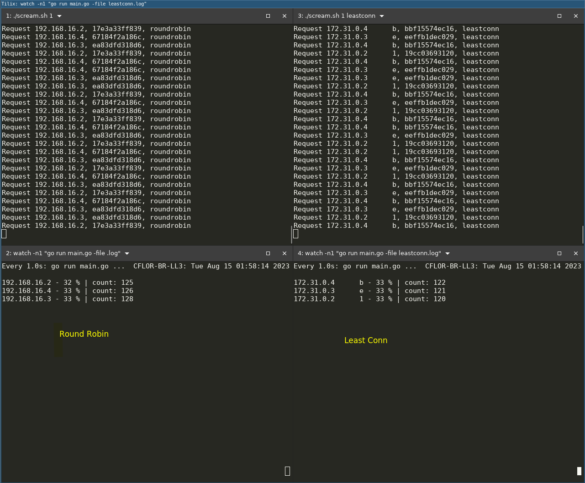

### Nginx load balancer examples

#### Simple round robin test

```bash
./build.sh --app serverapp # Build simple server app
./build.sh --app nginx # Build nginx image with custom configs
```

```bash
docker compose up --build -d # Up containers
```

#### Use scream to multiple requests
```bash
./scream <seconds> <lb_type> # LB type could be empty or leastconn
```

This script will send a request to localhost in the port `3000` following the defined interval in seconds

#### Watch the balancer work

```bash
cd counter
go run main.go -f <.log|leastconn.log> # Depending on which log to look for
```

This program will count the ip returned from the app. And show in percentage.



### Manual tests

Execute this command more than once to get different container ip and HOSTNAME
```bash
# Testing balancer
curl -H "Host: serverapp.com" localhost:3000 # or use localhost:3000/leastconn to leastconn load balancer
{
    "ip": "192.168.16.3", # The ip of the container extracted from /etc/hosts
    "container_name": "504d4643d32f", # The HOSTNAME of the container
    "lb_type": "leastconn"
}
```

#### Testing the balacing with count

```bash
while true; do curl -s -H "Host: serverapp.com" localhost:3000 | jq -r '.ip' >> counter/log; done
```
From another terminal run
```bash
cd counter
watch -n1 go run main.go

# e.g. output
192.168.16.3 - 33 % | count: 325
192.168.16.4 - 33 % | count: 323
192.168.16.2 - 33 % | count: 326
```

